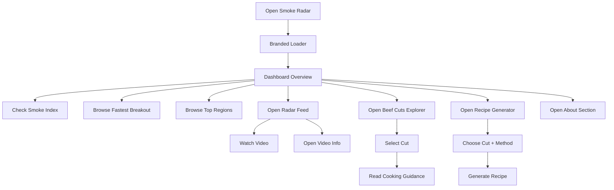
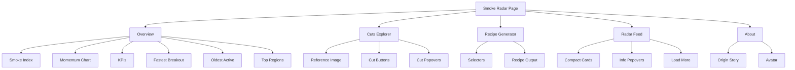

# Smoke Radar – Product Spec & Feature Roadmap

## Overview
**Smoke Radar** is a meat-content intelligence dashboard built to surface the most interesting, relevant, and fast-moving meat videos without endless scrolling.

It combines:
- live or cached radar data
- content momentum signals
- beef cut exploration
- structured recipe generation
- product personality and branded UX

---

## Product Goal
Help meat lovers, pitmasters, and curious food explorers discover:
- what is trending now
- which videos are accelerating fastest
- which cuts are worth exploring
- how to cook those cuts
- eventually, where to find quality butcher shops nearby

---

## Current Implemented Features

### 1. Core Dashboard
- Current Smoke Index
- Momentum Trend chart
- KPI summary cards
- Live / Cached / Offline state display
- Refresh button with branded loading state
- Opening branded loader

### 2. Content Intelligence
- Top Channels
- Hot Keywords
- Top Regions
- Fastest Breakout
- Oldest Active Video

### 3. Video Feed
- Compact video cards
- Smoke / VPH badge
- Duration badge
- Short / Long-form labeling
- Watch button
- Channel button
- Info popover per video
- Load More button

### 4. Beef Cuts Explorer
- Beef cuts reference image
- Tap-friendly cut buttons
- Popover with:
  - cut description
  - location on the cow
  - suitable cooking styles
  - quick pitmaster tip

### 5. Recipe Generator
- meat type selector
- cut selector
- cooking method selector
- flavor profile selector
- structured recipe output

### 6. Navigation & Product Identity
- sticky quick navigation bar
- About section
- creator avatar section
- product origin story
- product personality / branded tone

### 7. Backend / Platform
- Express server
- cache-based fallback
- quota cooldown logic
- health endpoint
- debug endpoints
- live/cached payload strategy

---

## Planned Features

### 1. AI Recipe Generator
Upgrade the current rule-based generator to real AI generation.

**User inputs**
- meat type
- cut
- cooking style
- flavor profile
- optional skill level

**AI output**
- recipe title
- ingredient list
- steps
- timing
- target doneness / temperature
- chef tips

### 2. Butcher Radar
Location-based butcher discovery.

**Potential inputs**
- city
- address
- current location

**Potential outputs**
- nearby butcher shops
- map view
- specialties
- ratings
- hours
- premium / BBQ-friendly / steak-focused tagging

### 3. Sound Design
Optional sounds for:
- clicks
- cut selection
- refresh
- sear / smoke vibes

### 4. Future Intelligence Layers
- stronger regional inference
- butcher quality ranking
- deeper discovery and recommendation logic
- advanced filters and saved preferences

---

## User Experience Flow



---

## High-Level Product Architecture

```mermaid
flowchart LR
    A[Frontend / index.html] --> B[/api/smoke-radar]
    B --> C[Express Server]
    C --> D[YouTube API]
    C --> E[cache.json]
    C --> F[runtime-state.json]

    A --> G[Recipe Generator UI]
    G --> H[Current rule-based recipe logic]
    H -. planned .-> I[AI Recipe API]

    A --> J[Butcher Radar UI]
    J -. planned .-> K[Location / Maps / Places API]
```

---

## Current Section Map



---

## Product Positioning
Smoke Radar is not just a list of links.

It is designed to feel like:
- a premium meat discovery tool
- a content intelligence dashboard
- a practical exploration layer for cuts and cooking
- eventually, a local butcher discovery companion

---

## Suggested Roadmap Order

### Phase 1 – Stabilized Base
- dashboard
- feed
- cuts explorer
- branded UX
- about section

### Phase 2 – Intelligence Expansion
- AI Recipe Generator
- stronger metadata extraction
- better regional logic

### Phase 3 – Local Utility
- Butcher Radar
- map integrations
- butcher categorization

### Phase 4 – Experience Polish
- sound design
- saved settings
- filters
- favorites / watchlist
- recommendation logic

---

## GitHub Notes
This document is designed for GitHub and supports Mermaid diagrams natively in Markdown.

Recommended filename:
`SMOKE_RADAR_SPEC.md`
